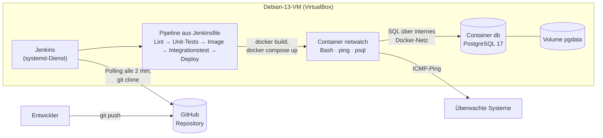
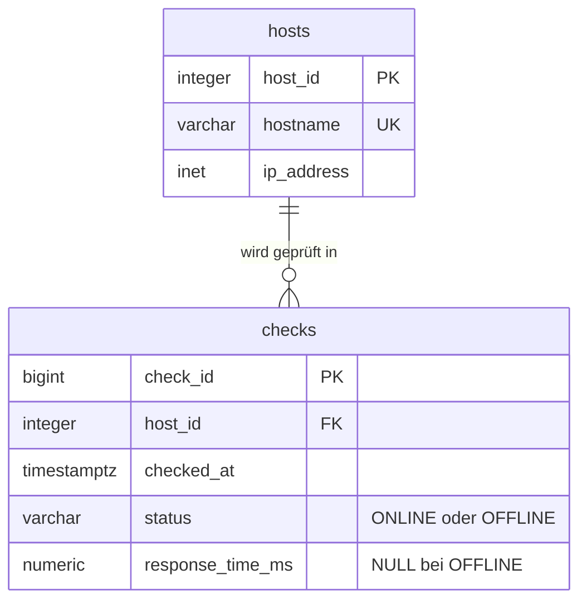

# NetWatch – CI/CD-Prototyp mit GitHub, Jenkins und Docker

Prototyp der NetDorm Solutions GmbH: Die Monitoring-Anwendung **NetWatch** (Bash) prüft
jede Minute per Ping, ob Server und Netzwerkgeräte erreichbar sind, und speichert die
Ergebnisse in einer **PostgreSQL**-Datenbank. Jeder Push auf GitHub wird von **Jenkins**
automatisch getestet und – nur wenn alle Tests bestanden sind – als neuer
**Docker**-Container bereitgestellt.

## Architektur



## Aufbau des Repositorys

| Pfad | Inhalt |
|------|--------|
| `bin/netwatch.sh` | Monitoring-Skript: Hostliste lesen, pingen, Ergebnis speichern |
| `bin/netwatch-report.sh` | Konsolenanzeige der letzten Ergebnisse |
| `config/hosts.conf` | Zu überwachende Systeme (`hostname ip`) |
| `config/hosts.test.conf` | Feste Hostliste für den automatisierten Integrationstest |
| `sql/schema.sql` | Tabellen, Index und View (wird beim Start automatisch angelegt) |
| `Dockerfile` | Image der Anwendung (Debian 13 slim, eigener Benutzer ohne Root-Rechte) |
| `compose.yaml` | Anwendung + Datenbank als getrennte Container, Volume für die Daten |
| `Jenkinsfile` | CI/CD-Pipeline |
| `tests/netwatch.bats` | Unit-Tests (bats) für die Funktionen des Skripts |
| `tests/integration.sh` | Integrationstest mit echter Test-Datenbank |
| `.env.example` | Vorlage für Zugangsdaten – die echte `.env` wird nie committed |
| `docs/` | VM-Einrichtung und Testkonzept |

## Datenmodell (ERM)



Die View `v_latest_status` liefert das jeweils letzte Ergebnis je System.

## Pipeline

| Stage | Was passiert | Bei Fehler |
|-------|--------------|------------|
| Checkout | Quellcode aus GitHub holen | Abbruch |
| Lint | ShellCheck prüft alle Bash-Skripte | Abbruch, kein Image |
| Unit-Tests | bats testet die Funktionen (ohne Netz/DB), Ergebnis als JUnit-Report | Abbruch, kein Image |
| Image bauen | `docker build` → `netwatch:<Buildnummer>` | Abbruch |
| Integrationstest | Test-DB + NetWatch in eigenem Compose-Projekt, Prüfung direkt in der DB | Abbruch, Image wird gelöscht |
| Deploy | `docker compose up` der neuen Version, Tag `latest` | – |

Da jede Stage die Pipeline bei einem Fehler abbricht, wird eine fehlerhafte Version
**nie** bereitgestellt; die zuletzt erfolgreiche Version läuft weiter.

## Entscheidungen

### Jenkins direkt auf der VM (nicht als Container)

- Die Pipeline startet selbst Container (`docker build`, `docker compose`). Direkt auf der VM
  nutzt Jenkins einfach den Docker-Dienst des Systems. Als Container bräuchte Jenkins
  zusätzlich Docker-CLI im Image und den gemounteten Docker-Socket oder „Docker in Docker“
  (privilegierter Container).
- Pfade im Workspace sind für Jenkins und Docker identisch – Bind-Mounts wie
  `-v "$WORKSPACE:/code"` funktionieren ohne Umrechnung.
- Jenkins läuft als systemd-Dienst und startet nach einem Neustart der VM automatisch.
- Nachteil: Java und Jenkins liegen direkt auf dem System; ein Update ist aufwändiger als
  ein neues Image. Die Mitgliedschaft von `jenkins` in der Gruppe `docker` entspricht
  Root-Rechten – das gilt beim gemounteten Socket aber genauso.

### Polling statt Webhook

| | Polling | Webhook |
|---|---------|---------|
| Prinzip | Jenkins fragt regelmäßig bei GitHub nach neuen Commits | GitHub schickt bei jedem Push eine HTTP-Anfrage an Jenkins |
| Verzögerung | bis zum nächsten Intervall (hier max. 2 min) | wenige Sekunden |
| Last | Anfragen auch ohne Änderungen | nur bei tatsächlichen Änderungen |
| Netzwerk | nur ausgehende Verbindungen nötig | Jenkins muss **aus dem Internet erreichbar** sein |
| Sicherheit | kein offener Port | öffentlicher Endpunkt, Absicherung per Secret/HTTPS nötig |

Die VM steht hinter dem VirtualBox-NAT im Schulnetz und ist aus dem Internet nicht erreichbar –
ein GitHub-Webhook käme nie an. Deshalb nutzt die Pipeline **Polling** (`pollSCM('H/2 * * * *')`).
Mögliche Erweiterung: Webhook über einen Weiterleitungsdienst wie smee.io, der nur eine
ausgehende Verbindung braucht.

### PostgreSQL

- Die Datentypen `inet` (IP-Adresse, wird automatisch auf Gültigkeit geprüft) und
  `timestamptz` (Zeit mit Zeitzone) passen direkt zu den Monitoring-Daten.
- `psql` kann Werte als Variablen (`:'name'`) sicher in SQL einsetzen – wichtig, weil das
  Bash-Skript keine Datenbankbibliothek mit Prepared Statements hat.
- Das offizielle Image bringt mit `pg_isready` ein Werkzeug für den Healthcheck mit.

### Zugangsdaten

- Keine Passwörter im Code, im Jenkinsfile oder im Image (`.dockerignore`).
- Lokal: Datei `.env` (in `.gitignore`), Vorlage `.env.example`.
- Pipeline: Jenkins-Credential `netwatch-db`, wird nur in der Stage *Deploy* eingeblendet.
- Integrationstest: bei jedem Lauf zufällig erzeugtes Einmal-Passwort.
- Die Datenbank veröffentlicht keinen Port nach außen.

## Schnellstart (auf der VM)

```bash
git clone https://github.com/anguishhh/LeeroyJenkinsPipeline.git netwatch
cd netwatch
cp .env.example .env && nano .env          # Passwort setzen
docker compose up -d --build
docker compose logs -f netwatch            # Prüfergebnisse live
docker compose exec netwatch netwatch-report.sh
```

Integrationstest manuell: `docker build -t netwatch:dev . && NETWATCH_TAG=dev bash tests/integration.sh`

Weitere Dokumentation: [VM-Einrichtung](docs/vm-setup.md) · [Testkonzept](docs/testkonzept.md)
